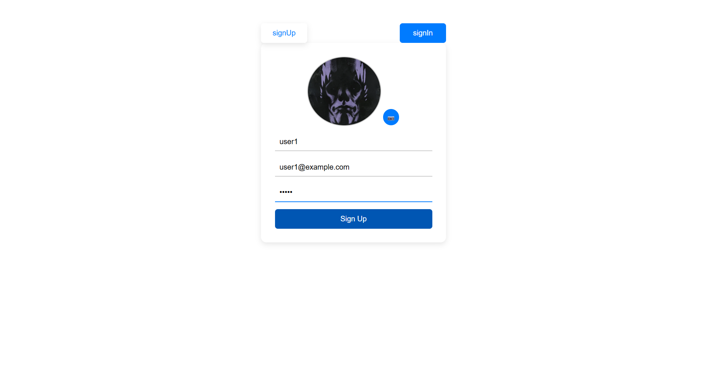
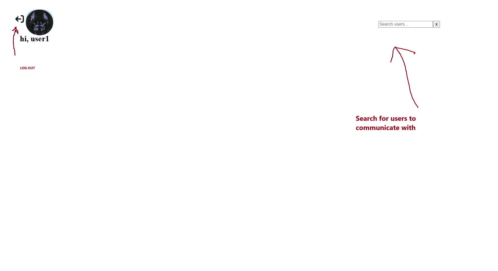
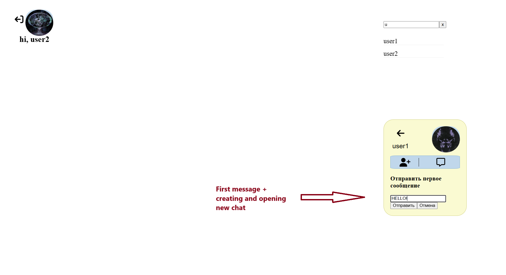
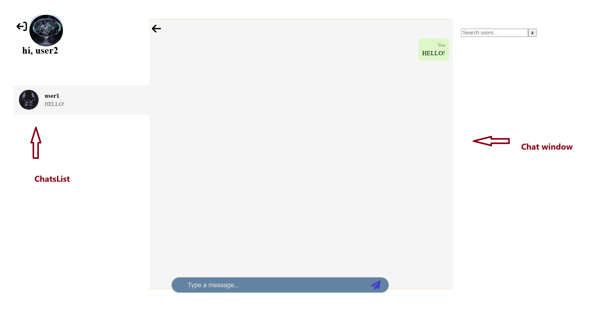
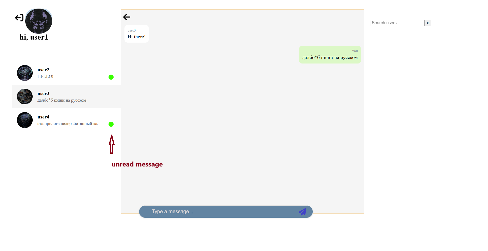

# 💬 Chat Messenger App

Мессенджер с авторизацией, реализованный на стеке **PERN (PostgreSQL, Express, React, Node.js)**. Позволяет регистрироваться, входить в аккаунт, искать пользователей и переписываться в реальном времени.

## 🚀 Функциональность

- 🔐 Регистрация и вход
- 👤 Поиск пользователей
- 💬 Переписка (REST или WebSocket)
- 🖼️ Поддержка аватарок

---

## 📸 Скриншоты

### 1. Авторизация

  
🔐 Регистрация с добавлением аватарки (необязательно), заполнением username, email и пароля.

---

### 2. Главная страница

  
👤 Поиск пользователей для общения. В верхнем левом углу — кнопка выхода из аккаунта.

---

### 3. Отправка первого сообщения и открытие нового чата

  
💬 Нажмите по найденному пользователю, затем на иконку сообщения. Если с этим пользователем ещё не было чата, откроется модальное окно для первого сообщения.

---

### 4. Список чатов и непрочитанные сообщения

  


---

## 🛠️ Технологии

### Клиент:
- React + Vite
- React Router DOM
- Redux Toolkit + RTK Query
- CSS
- Axios

### Сервер:
- Node.js + Express
- PostgreSQL + Sequelize
- Multer (загрузка аватарок)
- JWT (JSON Web Tokens)

---

## 📦 Установка и запуск

### 1. Клонируй проект

```bash
git clone https://github.com/umer134/PERN_Messenger.git
cd PERN_Messenger
```

### 2. Добавь файл для переменных окружения(env) и вставь свои значения в следующих полях

### Сервер:
PORT=
DB_USERNAME=
DB_NAME=
DB_PASSWORD=
DB_PORT=
LOCALHOST=
DIALECT=
JWT_ACCESS_SECRET=
JWT_REFRESH_SECRET=
SMTP_HOST=
SMTP_PORT=
SMTP_USER=
SMTP_PASSWORD=
API_URL=
CLIENT_URL=

### Клиент:
VITE_API_URL=(при загрузках аватарок с сервера приходит относительный путь, поэтому нужно хранить API_URL, для использования в разных частях приложения)

### 3. Установите зависимости и запустет проек:
project/server
npm install
npm run dev

project/client
npm install
npm run dev

---

📌 TODO на ближайшие месяцы:

1. Отправка уведомлений. ✅
2. Расширить разнообразие отправляемого контента в чате(эмодзи, файлы). ✅
3. Темная тема. ✅
4. Вкладка настроек.
5. Функицонал редактирования профиля.
6. Добавление контактов/друзей


---