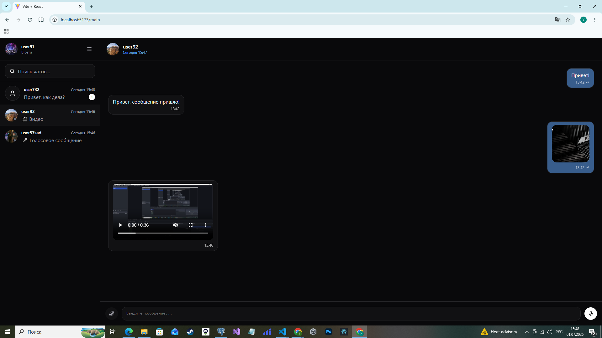
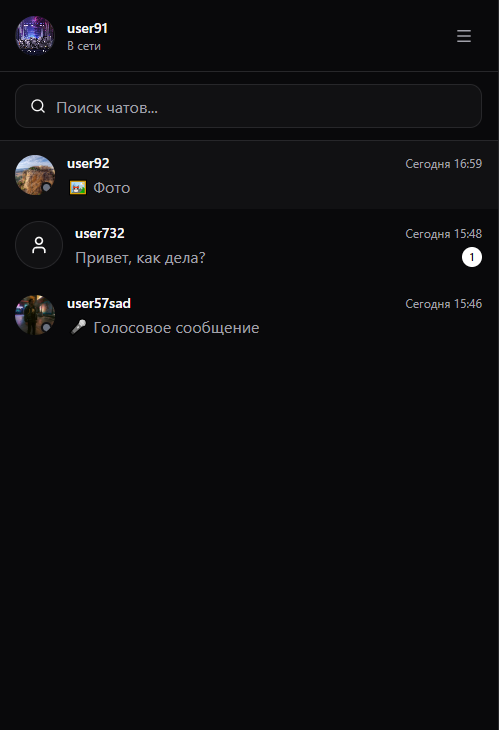
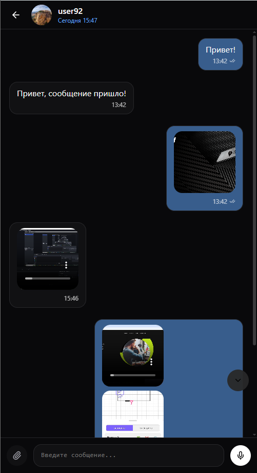
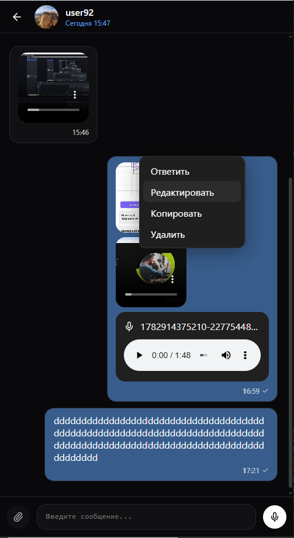
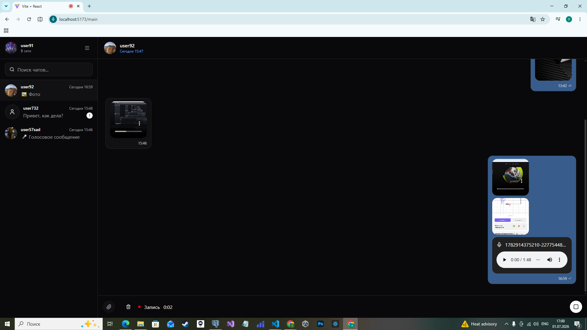
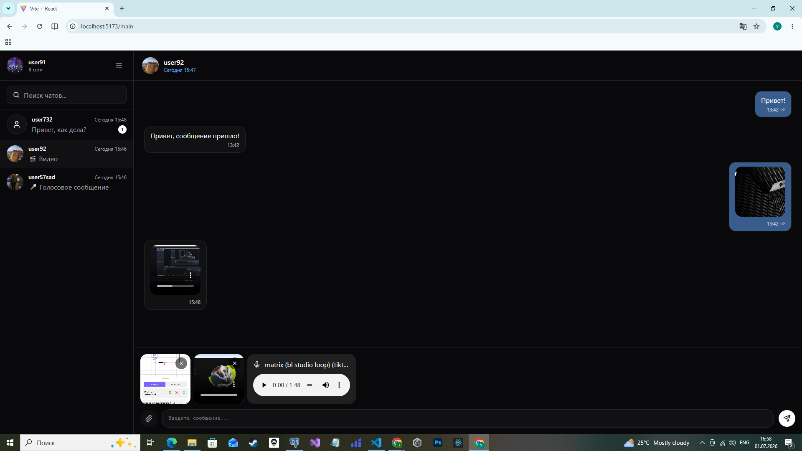

# PERN Messenger

A full-stack real-time messenger built with React, Express, PostgreSQL and Socket.IO.

## Preview

### Main



### Mobile adaptive





### Message actions



### Recording voice



### AttachmentPreview



---

## Features

- Authentication & Authorization
- Real-time messaging
- Private conversations
- Online users
- Typing indicators
- Voice messages
- Image & file attachments
- Responsive UI
- JWT authentication
- Persistent chat history

---

## Tech Stack

### Frontend

- React
- TypeScript
- Vite
- Redux Toolkit
- React Query
- React Router
- Axios
- SCSS

### Backend

- Node.js
- Express
- Socket.IO
- PostgreSQL
- JWT
- bcrypt
- Multer
- Cookie Parser

---

## Architecture

```
Client (React)
        │
 REST API + Socket.IO
        │
Express Server
        │
 PostgreSQL
```

The REST API handles authentication, user management, file uploads and chat history, while Socket.IO provides real-time communication between connected clients.

---

## Project Structure

```
client/
    src/
    public/

server/
    controllers/
    middleware/
    routes/
    sockets/
    database/
```

---

## Getting Started

### Clone repository

```bash
git clone <repository-url>
```

### Install dependencies

Client

```bash
cd client
npm install
```

Server

```bash
cd server
npm install
```

### Configure environment

Create a `.env` file inside the server directory.

Example:

```env
PORT=5000

DATABASE_URL=

JWT_SECRET=

CLIENT_URL=http://localhost:5173
```

---

### Run backend

```bash
cd server
npm run dev
```

### Run frontend

```bash
cd client
npm run dev
```

---

## Main Challenges

### Real-time synchronization

Implemented Socket.IO event architecture for instant message delivery, typing indicators and online presence.

### Authentication

Built JWT authentication with protected routes and persistent sessions.

### Media Support

Implemented image uploads and voice messages while keeping the messaging experience responsive.

---

## Future Improvements

- Group chats
- Message reactions
- Read receipts
- Video calls
- Push notifications
- Message search
- End-to-end encryption

---

## License

This project is created for educational and portfolio purposes.
